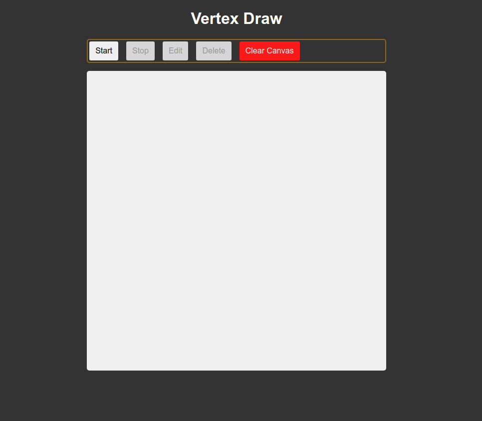

# Vertex Draw

## Description

A very minimal drawing application created with HTML, CSS and JavaScript using the browser's Canvas API.

## Table of Contents

- [Installation](#installation)
- [Usage](#usage)
- [Output](#output)

## Installation

- Clone this repo to your local environment
- CD(Change Directory) into the project folder
- Open a terminal at the root directory of the project and run `npm install` to install the dependencies
- Run `npm run dev` in your terminal to start the project locally.

## Usage

Open a browser window and navigate to http://localhost:5173 to access the project locally. Start clicking on the canvas and draw any shapes you want.

## Output

